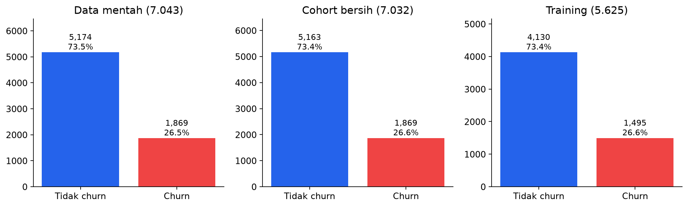
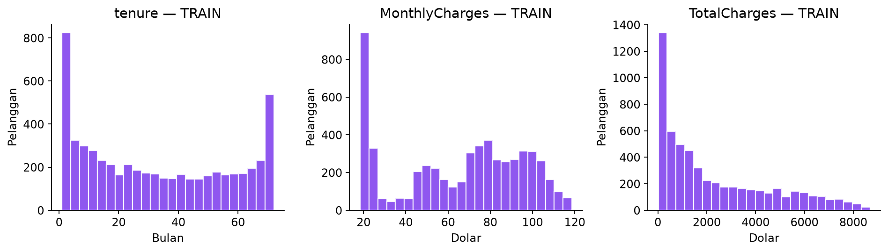
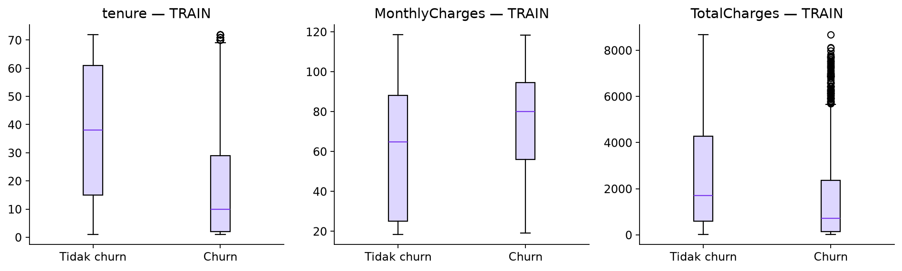
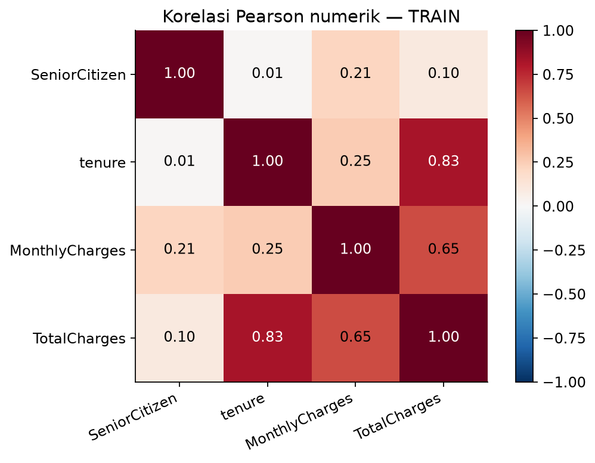
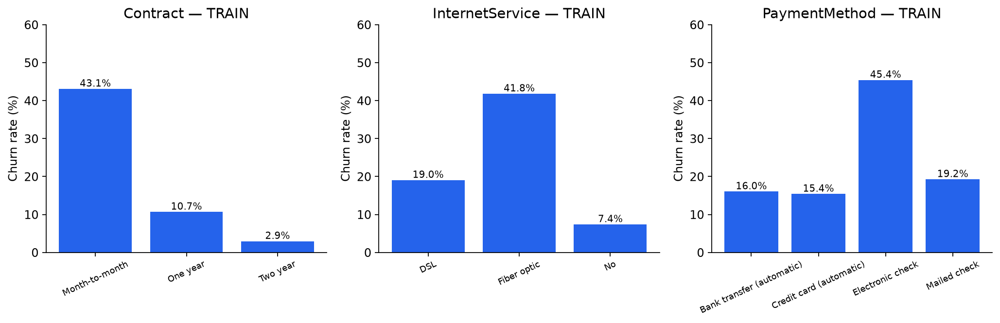
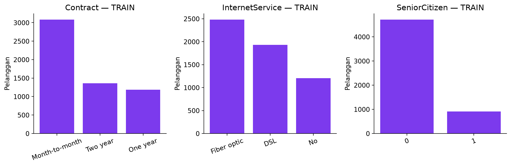
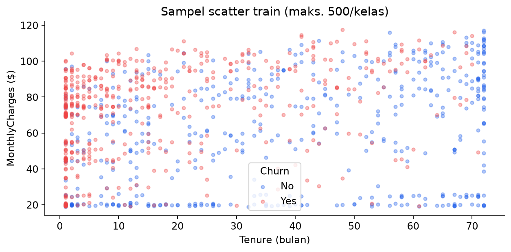

# Exploratory Data Analysis — Telco Churn

Kelompok 12 • Kelas B2

Sumber: https://www.kaggle.com/datasets/blastchar/telco-customer-churn

## 1. Informasi dataset

Mentah: **7,043 pelanggan, 21 kolom**. Cohort bersih: **7,032 pelanggan, 18 fitur + 1 target**. customerID adalah ID; Churn Yes=1, No=0. Grafik hubungan fitur–target memakai train saja (5.625); test (1.407) disimpan untuk evaluasi akhir. Pemeriksaan kualitas data mentah tidak melakukan fitting preprocessing.

## 2. Kamus variabel

| Variabel | Tipe CSV | Tipe semantik | Jumlah nilai unik | Arti | Peran |
| --- | --- | --- | --- | --- | --- |
| customerID | str | ID | 7043 | Identitas unik pelanggan; tidak digunakan model. | dihapus |
| gender | str | kategorikal | 2 | Jenis kelamin pelanggan (Female/Male). | fitur |
| SeniorCitizen | int64 | kategorikal | 2 | Indikator pelanggan senior: 1=ya, 0=tidak. | fitur |
| Partner | str | kategorikal | 2 | Apakah pelanggan memiliki pasangan (Yes/No). | fitur |
| Dependents | str | kategorikal | 2 | Apakah pelanggan memiliki tanggungan (Yes/No). | fitur |
| tenure | int64 | numerik diskrit | 73 | Lama berlangganan, dalam bulan. | fitur |
| PhoneService | str | kategorikal | 2 | Apakah pelanggan memakai layanan telepon (Yes/No). | fitur |
| MultipleLines | str | kategorikal | 3 | Layanan beberapa jalur telepon; No phone service jika tanpa telepon. | fitur |
| InternetService | str | kategorikal | 3 | Jenis internet: DSL, Fiber optic, atau No. | fitur |
| OnlineSecurity | str | kategorikal | 3 | Layanan keamanan online; No internet service jika tanpa internet. | fitur |
| OnlineBackup | str | kategorikal | 3 | Layanan backup online; No internet service jika tanpa internet. | fitur |
| DeviceProtection | str | kategorikal | 3 | Layanan perlindungan perangkat; No internet service jika tanpa internet. | fitur |
| TechSupport | str | kategorikal | 3 | Layanan bantuan teknis; No internet service jika tanpa internet. | fitur |
| StreamingTV | str | kategorikal | 3 | Layanan streaming TV; No internet service jika tanpa internet. | fitur |
| StreamingMovies | str | kategorikal | 3 | Layanan streaming film; No internet service jika tanpa internet. | fitur |
| Contract | str | kategorikal | 3 | Durasi kontrak: Month-to-month, One year, Two year. | fitur |
| PaperlessBilling | str | kategorikal | 2 | Penggunaan tagihan tanpa kertas (Yes/No). | fitur |
| PaymentMethod | str | kategorikal | 4 | Metode pembayaran: cek elektronik/pos atau transfer/kartu otomatis. | fitur |
| MonthlyCharges | float64 | numerik kontinu | 1585 | Tagihan bulanan pelanggan, dalam dolar. | fitur |
| TotalCharges | str | numerik kontinu | 6530 | Total tagihan kumulatif; tidak digunakan model aplikasi. | dihapus |
| Churn | str | target biner | 2 | Target: Yes=berhenti berlangganan, No=tidak berhenti dalam periode label dataset. | target |

## 3. Statistik deskriptif

| index | tenure | MonthlyCharges | TotalCharges |
| --- | --- | --- | --- |
| count | 7043.0 | 7043.0 | 7032.0 |
| mean | 32.371 | 64.762 | 2283.3 |
| std | 24.559 | 30.09 | 2266.771 |
| min | 0.0 | 18.25 | 18.8 |
| 25% | 9.0 | 35.5 | 401.45 |
| 50% | 29.0 | 70.35 | 1397.475 |
| 75% | 55.0 | 89.85 | 3794.738 |
| max | 72.0 | 118.75 | 8684.8 |

## 4. Missing value

| Kolom | Missing CSV awal | Missing setelah konversi | Missing cohort bersih |
| --- | --- | --- | --- |
| customerID | 0 | 0 | 0 |
| gender | 0 | 0 | 0 |
| SeniorCitizen | 0 | 0 | 0 |
| Partner | 0 | 0 | 0 |
| Dependents | 0 | 0 | 0 |
| tenure | 0 | 0 | 0 |
| PhoneService | 0 | 0 | 0 |
| MultipleLines | 0 | 0 | 0 |
| InternetService | 0 | 0 | 0 |
| OnlineSecurity | 0 | 0 | 0 |
| OnlineBackup | 0 | 0 | 0 |
| DeviceProtection | 0 | 0 | 0 |
| TechSupport | 0 | 0 | 0 |
| StreamingTV | 0 | 0 | 0 |
| StreamingMovies | 0 | 0 | 0 |
| Contract | 0 | 0 | 0 |
| PaperlessBilling | 0 | 0 | 0 |
| PaymentMethod | 0 | 0 | 0 |
| MonthlyCharges | 0 | 0 | 0 |
| TotalCharges | 0 | 11 | 0 |
| Churn | 0 | 0 | 0 |

Sebelas string kosong pada TotalCharges terdeteksi setelah konversi numerik. Seluruhnya tenure=0 dan Churn=No. Cohort awal dipertahankan untuk perbandingan eksperimen; karena fitur TotalCharges akhirnya dihapus, membuang baris ini bukan keharusan model. Eksklusi pelanggan baru merupakan keterbatasan yang perlu diuji pada pengembangan berikutnya.

## 5. Duplikat

| Pemeriksaan | Jumlah |
| --- | --- |
| raw_full_rows | 0 |
| customerID | 0 |
| raw_without_id | 22 |
| clean_without_id_total_including_target | 27 |
| clean_features_only | 48 |
| test_features_matching_train | 18 |

Tidak ada ID ganda atau baris mentah identik. Setelah fitur identitas/kumulatif dihapus, sebagian profil menjadi sama. ID berbeda dapat mewakili pelanggan berbeda, sehingga tidak dihapus otomatis. Ada profil test identik dengan train; ini membatasi klaim generalisasi untuk profil yang benar-benar baru. Pengembangan: evaluasi group-aware berdasarkan profil untuk mengukur sensitivitas hasil.

## 6. Outlier

| Variabel | Minimum | Maximum | Batas IQR bawah | Batas IQR atas | Jumlah outlier IQR |
| --- | --- | --- | --- | --- | --- |
| tenure | 0.0 | 72.0 | -60.0 | 124.0 | 0 |
| MonthlyCharges | 18.25 | 118.75 | -46.025 | 171.375 | 0 |
| TotalCharges | 18.8 | 8684.8 | -4688.4813 | 8884.6688 | 0 |

Tidak ada outlier dengan aturan 1,5×IQR pada tiga fitur numerik. Ini tidak berarti semua catatan bebas anomali domain. Tidak dilakukan clipping/penghapusan outlier; nilai layanan sah dipertahankan.

## 7. Visualisasi dan interpretasi

### 01_target_distribution.png

Kelas tidak churn dominan (sekitar 73,4%) dan churn sekitar 26,6% pada cohort bersih. Accuracy saja dapat menutupi kegagalan mendeteksi kelas churn; gunakan precision, recall, dan F1.

### 02_numeric_histograms_train.png

Tenure mencakup pelanggan baru hingga 72 bulan; tagihan memiliki beberapa kelompok sesuai paket layanan. TotalCharges berhubungan dengan durasi berlangganan. Bentuk histogram tidak mengharuskan normalisasi agar normal; StandardScaler digunakan untuk skala numerik Logistic Regression.

### 03_numeric_boxplots_train.png

Median tenure pelanggan churn pada train adalah 10 bulan, dibanding 38 bulan pada tidak churn. Median tagihan churn $79.90 vs $64.68. Ini hubungan deskriptif, bukan bukti bahwa menaikkan tagihan atau mengganti kontrak menyebabkan churn. Titik outlier boxplot dihitung per kelas; berbeda dari pemeriksaan IQR seluruh cohort pada tabel kualitas data.

### 04_correlation_train.png

Korelasi TotalCharges–tenure pada train adalah 0.827. Korelasi tinggi tidak membuktikan keduanya identik. TotalCharges dihapus untuk menyederhanakan input; manfaat penghapusan belum diuji dengan ablation.

### 05_categorical_churn_train.png

Pada train, churn rate kontrak bulanan 43.1%, sedangkan kontrak dua tahun 2.9%. Pelanggan fiber/electronic check juga memiliki profil churn berbeda. Asosiasi ini mendukung pemilihan fitur, bukan jaminan efektivitas saran retensi.

### 06_categorical_distribution_train.png

Distribusi kategori menunjukkan sebagian besar pelanggan bukan senior dan kategori kontrak/paket tidak sama besar. Bandingkan churn rate beserta jumlah pelanggan per kategori, sehingga kelompok kecil tidak dianggap mewakili seluruh populasi.

### 07_scatter_train.png

Kedua kelas saling tumpang tindih pada tenure dan tagihan; tidak ada satu batas sederhana yang memisahkan semua pelanggan churn. Grafik memakai sampel per kelas untuk keterbacaan, bukan untuk menghitung proporsi populasi.

## 8. Implikasi preprocessing

- StandardScaler pada SeniorCitizen (indikator biner), tenure, MonthlyCharges; OneHotEncoder pada 15 fitur kategorikal. Scaling indikator biner valid secara matematis, namun semantiknya tetap kategori; scaling tidak diperlukan pohon, dipakai untuk pipeline konsisten.

- Fit scaler/encoder hanya pada training fold melalui Pipeline; tidak memakai statistik test.

- Class weight diuji dalam GridSearch; tidak memakai SMOTE pada eksperimen ini.

- TotalCharges dihapus untuk input sederhana; tidak mengklaim koefisien negatif adalah kesalahan.

- Tabel lengkap churn rate semua kategori tersedia di categorical_churn_rates_train.csv.
